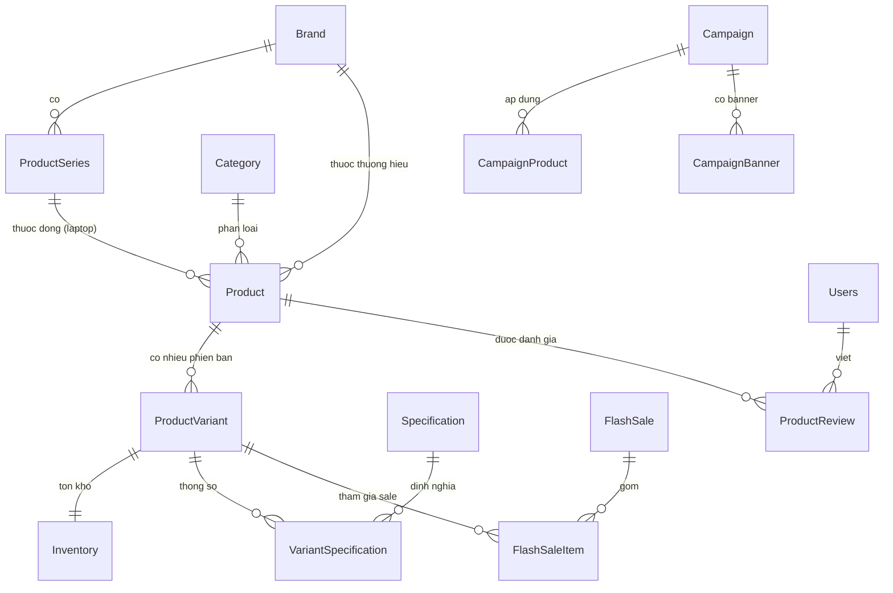

# 🛒 UniLap – Website bán Laptop & Phụ kiện công nghệ

UniLap là website thương mại điện tử bán **laptop, chuột, bàn phím và phụ kiện công nghệ**, xây dựng theo mô hình **MVC** với Java Servlet/JSP và SQL Server.

---

## 🚀 Công nghệ sử dụng

| Thành phần | Công nghệ |
|------------|-----------|
| Ngôn ngữ | Java 17 |
| Backend | Java Servlet + JSP (Jakarta EE) |
| View | JSP + JSTL 2.0 + EL |
| Database | Microsoft SQL Server |
| JDBC Driver | mssql-jdbc 13.4.0 |
| Mã hóa mật khẩu | jBCrypt 0.4 |
| Server | Apache Tomcat 10+ |
| Build tool | Apache Ant (NetBeans project) |
| Frontend | HTML5, CSS3, Vanilla JavaScript, FontAwesome 6.4 |

---

## 📋 Yêu cầu hệ thống

- **JDK 17** trở lên
- **Apache Tomcat 10** trở lên (Jakarta EE)
- **SQL Server 2019** trở lên (+ SQL Server Management Studio)
- **NetBeans 18+** (khuyến nghị, vì project dùng Ant) hoặc IDE hỗ trợ Tomcat

---

## 📂 Cấu trúc thư mục

```
UniLap_1/
├── build.xml                  # File cấu hình build của Ant
├── nbproject/                 # Cấu hình NetBeans
├── lib/                       # Thư viện (jdbc, jstl, jbcrypt)
└── src/
    ├── java/
    │   ├── controller/        # Servlet (xử lý request/response)
    │   ├── dal/               # Data Access Layer (DAO + DBContext)
    │   ├── model/             # Các lớp đối tượng (entity & view model)
    │   └── viewmodel/         # Lớp gộp dữ liệu để hiển thị
    └── web/
        ├── WEB-INF/
        │   ├── web.xml            # Khai báo servlet & mapping
        │   └── ConnectDB.properties   # Cấu hình kết nối DB
        ├── customer/          # JSP cho khách hàng (home, product_list, product_detail...)
        ├── admin/             # JSP cho quản trị
        ├── css/  js/  images/ # Tài nguyên tĩnh
```

---

## ⚙️ Hướng dẫn cài đặt

### 1. Clone dự án
```bash
git clone https://github.com/<tài-khoản>/UniLap.git
```

### 2. Tạo Database
- Mở **SQL Server Management Studio (SSMS)**.
- Tạo database tên `unilap_db`.
- Chạy file script SQL (đặt trong thư mục `/database` của repo) để tạo bảng + dữ liệu mẫu.

### 3. Cấu hình kết nối DB
Mở file `web/WEB-INF/ConnectDB.properties` và sửa cho khớp máy bạn:
```properties
url=jdbc:sqlserver://localhost:1433;databaseName=unilap_db;encrypt=true;trustServerCertificate=true
userID=sa
password=<mật-khẩu-SQL-Server-của-bạn>
```

### 4. Mở dự án & cấu hình Server
- Mở project bằng **NetBeans** (`File → Open Project`).
- Vào `Services → Servers` thêm **Apache Tomcat** nếu chưa có.
- Đảm bảo các file `.jar` trong thư mục `lib/` đã được nạp vào project.

### 5. Chạy ứng dụng
- Nhấn **Run (F6)** trong NetBeans.
- Truy cập: **http://localhost:8080/UniLap/**
  > Context path mặc định là `/UniLap` (khai báo trong `META-INF/context.xml`).

---

## 🧩 Mối quan hệ giữa các Model

### Sơ đồ tổng quan



### Giải thích các lớp model chính

| Model | Vai trò | Quan hệ chính |
|-------|---------|---------------|
| **Brand** | Thương hiệu (ASUS, Logitech...) | 1 Brand → N Product, N ProductSeries |
| **Category** | Danh mục (Laptop, Chuột, Bàn phím) | 1 Category → N Product |
| **ProductSeries** | Dòng sản phẩm (vd ROG, TUF) | Thuộc 1 Brand → N Product |
| **Product** | Sản phẩm tổng quát | Thuộc 1 Brand + 1 Category; có N ProductVariant |
| ↳ **Laptop / Mouse / Keyboard** | Lớp con của Product | Bổ sung thuộc tính riêng (CPU/RAM/SSD, DPI, switch...) |
| **ProductVariant** | Phiên bản cụ thể (RAM/SSD, màu...) | Thuộc 1 Product; gắn Inventory, Specification, FlashSale |
| **Specification / VariantSpecification** | Thông số kỹ thuật | VariantSpecification nối Variant ↔ Specification (nhiều-nhiều) |
| **FlashSaleProduct** | Sản phẩm đang Flash Sale (view model) | Lấy giá sale theo thời gian thực |
| **Campaign** | Chiến dịch khuyến mãi | 1 Campaign → N CampaignProduct, N CampaignBanner |
| **Users** | Tài khoản khách hàng / quản trị | Mật khẩu mã hóa jBCrypt; viết ProductReview |
| **WarrantyPolicy / PageContent** | Nội dung CMS (bảo hành, chính sách) | Độc lập |

> **Lưu ý về lớp con sản phẩm:** `Product` là lớp cha; `Laptop`, `Mouse`, `Keyboard` kế thừa và thêm thuộc tính đặc thù (Laptop: cpu/ram/ssd/gpu/screen, Mouse: connectivity/dpi, Keyboard: connectivity/switchType).
>
> **View model** (`DashboardSummary`, `ProductSearchItem`, `CampaignStats`, `CampaignSalesVolume`, `FlashSaleProduct`) là các lớp gộp dữ liệu phục vụ hiển thị, không ánh xạ 1-1 với bảng trong DB.

---

## 🏗️ Kiến trúc MVC

```
Người dùng → JSP (View)
                │
                ▼
        Servlet (Controller)  ──► DAO (dal/) ──► DBContext ──► SQL Server
                │
                ▼
         Model (entity/view model)
```

- **Model** (`src/java/model`): các lớp đối tượng dữ liệu.
- **View** (`web/`): các trang JSP hiển thị.
- **Controller** (`src/java/controller`): các Servlet điều phối luồng xử lý.
- **DAL** (`src/java/dal`): truy vấn database, kế thừa từ `DBContext`.

---

## 📝 Ghi chú

- File `ConnectDB.properties` chứa thông tin nhạy cảm → nên thêm vào `.gitignore` nếu dùng repo công khai.
- Gợi ý nội dung `.gitignore`:
  ```gitignore
  /build/
  /dist/
  /nbproject/private/
  ```

---

© 2026 UniLap. Đồ án website thương mại điện tử.
