# WARRANTY FLOW DATABASE DESIGN SPECIFICATION
## (Customer & Admin/Staff Sides — FPT Standard SDS Template)

This section details the database schema design specifically for the **Warranty Flow** of the UniLap store website. It covers both the **Customer side** (eligibility check, request submission, cancellation, and tracking) and the **Admin/Staff side** (policy templates management, request assignment, processing, and audit logs).

---

### 1.3.1 Core Customer Purchase & Inventory Tables

These existing tables are referenced in the customer warranty flow to identify authenticated users, list completed orders, verify ownership of product serial numbers, and compute the active warranty duration.

#### 1.3.1.1 User
Stores customer and staff account profiles, contact details, and security roles.
* PK ~ Primary Key; FK ~ Foreign Key; UN ~ Unique; NN ~ not null
| No | Field | PK | FK | UN | NN | Description |
| :--- | :--- | :---: | :---: | :---: | :---: | :--- |
| 01 | `user_id` | x | | x | x | Primary key, unique identifier of the user. |
| 02 | `role_id` | | x | | x | Foreign key referencing `Role(role_id)`, defines permissions. |
| 03 | `full_name` | | | | x | User's full name. |
| 04 | `email` | | | x | x | Unique email address of the user (used for login). |
| 05 | `phone` | | | x | x | Unique contact phone number. |
| 06 | `password` | | | | x | Hashed password for security authentication. |
| 07 | `status` | | | | x | Account activation status (e.g. Active, Locked, Inactive). |

#### 1.3.1.2 Order
Stores purchase orders placed by customers, recording total amounts, status, and completion dates.
* PK ~ Primary Key; FK ~ Foreign Key; UN ~ Unique; NN ~ not null
| No | Field | PK | FK | UN | NN | Description |
| :--- | :--- | :---: | :---: | :---: | :---: | :--- |
| 01 | `order_id` | x | | x | x | Primary key, unique identifier of the order. |
| 02 | `user_id` | | x | | x | Foreign key referencing `User(user_id)`, links order to customer. |
| 03 | `payment_id` | | x | | | Foreign key referencing `Payment(payment_id)`, links to transaction. |
| 04 | `voucher_id` | | x | | | Foreign key referencing `Voucher(voucher_id)`, discount voucher code. |
| 05 | `total_amount` | | | | x | Net amount paid for the order. |
| 06 | `order_status` | | | | x | Order state (e.g., COMPLETED, PENDING, CANCELLED). |
| 07 | `shipping_receiver` | | | | x | Name of the shipping recipient. |
| 08 | `shipping_phone` | | | | x | Phone number of the shipping recipient. |
| 09 | `shipping_address` | | | | x | Address details for shipping. |
| 10 | `order_code` | | | x | x | Unique order identifier code. |
| 11 | `created_at` | | | | x | Timestamp when the order was submitted. |
| 12 | `completed_at` | | | | | Timestamp when order reached COMPLETED (marks warranty start). |

#### 1.3.1.3 OrderDetail
Stores details of specific variants and quantities purchased within a customer order.
* PK ~ Primary Key; FK ~ Foreign Key; UN ~ Unique; NN ~ not null
| No | Field | PK | FK | UN | NN | Description |
| :--- | :--- | :---: | :---: | :---: | :---: | :--- |
| 01 | `order_detail_id` | x | | x | x | Primary key, unique identifier of the order detail line item. |
| 02 | `order_id` | | x | | x | Foreign key referencing `Order(order_id)`, links to parent order. |
| 03 | `variant_id` | | x | | x | Foreign key referencing `ProductVariant(variant_id)`, links to variant. |
| 04 | `quantity` | | | | x | Number of units purchased. |
| 05 | `unit_price` | | | | x | Price per unit at the time of purchase. |

#### 1.3.1.4 OrderItemSerial
Maps specific physical item IDs to the order detail line under which they were sold.
* PK ~ Primary Key; FK ~ Foreign Key; UN ~ Unique; NN ~ not null
| No | Field | PK | FK | UN | NN | Description |
| :--- | :--- | :---: | :---: | :---: | :---: | :--- |
| 01 | `order_item_serial_id` | x | | x | x | Primary key, unique identifier of the item serial mapping. |
| 02 | `order_detail_id` | | x | | x | Foreign key referencing `OrderDetail(order_detail_id)`. |
| 03 | `item_id` | | x | | x | Foreign key referencing `InventoryItem(item_id)`. |
| 04 | `assigned_at` | | | | x | Date and time when the serial was allocated to this order. |

#### 1.3.1.5 InventoryItem
Stores records of individual physical units of products, containing unique serial/IMEI codes and custom warranty expiration dates.
* PK ~ Primary Key; FK ~ Foreign Key; UN ~ Unique; NN ~ not null
| No | Field | PK | FK | UN | NN | Description |
| :--- | :--- | :---: | :---: | :---: | :---: | :--- |
| 01 | `item_id` | x | | x | x | Primary key, unique identifier of the physical unit. |
| 02 | `variant_id` | | x | | x | Foreign key referencing `ProductVariant(variant_id)`, links to variant. |
| 03 | `serial_number` | | | x | x | Unique serial number of the device. |
| 04 | `imei` | | | x | | IMEI number (applicable for mobile devices). |
| 05 | `barcode` | | | x | | Barcode identifier of the item. |
| 06 | `status` | | | | x | Inventory status (e.g. IN_STOCK, SOLD, UNDER_WARRANTY). |
| 07 | `import_date` | | | | x | Date when the item was imported. |
| 08 | `sold_date` | | | | | Date when the item was sold. |
| 09 | `warranty_expired_date` | | | | | Custom Computed expiration date of the item's warranty. |
| 10 | `warehouse_location` | | | | | Location inside the physical warehouse. |
| 11 | `note` | | | | | Additional notes. |
| 12 | `created_at` | | | | x | Date and time the record was created. |
| 13 | `updated_at` | | | | x | Date and time the record was last updated. |
| 14 | `ticket_id` | | x | | | Foreign key referencing `Ticket(ticket_id)`, links to import ticket. |

#### 1.3.1.6 ProductVariant
Stores specifications variants of products (different RAM, SSD configuration, color).
* PK ~ Primary Key; FK ~ Foreign Key; UN ~ Unique; NN ~ not null
| No | Field | PK | FK | UN | NN | Description |
| :--- | :--- | :---: | :---: | :---: | :---: | :--- |
| 01 | `variant_id` | x | | x | x | Primary key, unique identifier of the variant. |
| 02 | `product_id` | | x | | x | Foreign key referencing `Product(product_id)`, links to base product. |
| 03 | `brand_id` | | x | | x | Foreign key referencing `Brand(brand_id)`, links to manufacturer. |
| 04 | `sku` | | | x | x | Unique Stock Keeping Unit identifying the variant. |
| 05 | `variant_name` | | | | x | Display name of the product variant configuration. |
| 06 | `import_price` | | | | x | Cost price at which the variant was imported. |
| 07 | `selling_price` | | | | x | Selling price at which the variant is sold to customers. |
| 08 | `is_serialized`| | | | x | Boolean flag: 1 (requires serial number tracking), 0 (no serial tracking). |
| 09 | `status` | | | | x | Variant active status (e.g. Active, Discontinued). |

#### 1.3.1.7 Product
Stores general attributes of store products, including default warranty periods and policy links.
* PK ~ Primary Key; FK ~ Foreign Key; UN ~ Unique; NN ~ not null
| No | Field | PK | FK | UN | NN | Description |
| :--- | :--- | :---: | :---: | :---: | :---: | :--- |
| 01 | `product_id` | x | | x | x | Primary key, unique identifier of the product. |
| 02 | `category_id` | | x | | x | Foreign key referencing `Category(category_id)`, links to category. |
| 03 | `brand_id` | | x | | x | Foreign key referencing `Brand(brand_id)`, links to brand. |
| 04 | `series_id` | | x | | | Foreign key referencing `ProductSeries(series_id)`, links to product line. |
| 05 | `product_name` | | | | x | General name of the product. |
| 06 | `description` | | | | | Detailed product specifications text. |
| 07 | `warranty_period`| | | | | Default warranty duration (in months) when no custom policy is applied. |
| 08 | `thumbnail` | | | | | Path or URL to the product's thumbnail image. |
| 09 | `created_at` | | | | x | Date and time when the product was created. |
| 10 | `warranty_policy_id`| | x | | | Foreign key referencing `WarrantyPolicies(PolicyID)`, links to custom policy template. |

---

### 1.3.2 Warranty Management & Claim Tables

These tables manage the specific warranty policy templates (Admin-configured), policy change histories, customer claim submissions, claim evidence images, and the technical processing history log.

#### 1.3.2.1 WarrantyPolicies
Stores templates of different warranty policies created by the Admin to apply to specific product categories/lines.
* PK ~ Primary Key; FK ~ Foreign Key; UN ~ Unique; NN ~ not null
| No | Field | PK | FK | UN | NN | Description |
| :--- | :--- | :---: | :---: | :---: | :---: | :--- |
| 01 | `PolicyID` | x | | x | x | Primary key, auto-incremented unique identifier of the warranty policy. |
| 02 | `PolicyName` | | | | x | Public name/title of the warranty policy. |
| 03 | `Description` | | | | | Short text summary describing the warranty coverage. |
| 04 | `PolicyContent` | | | | | Detailed terms and conditions HTML text of the warranty policy. |
| 05 | `ApplicableRegions`| | | | | Free text field describing geographical regions or product categories covered. |
| 06 | `WarrantyMonths` | | | | x | Number of months of warranty coverage provided under this policy. |
| 07 | `Status` | | | | x | Policy lifecycle state: "DRAFT", "LIVE", "DISABLED". |
| 08 | `Version` | | | | | Version string of the policy document (e.g., "1.0", "2.0"). |
| 09 | `EffectiveDate` | | | | | Date when the warranty policy starts to become active. |
| 10 | `CreatedAt` | | | | x | Timestamp when the warranty policy record was created. |
| 11 | `UpdatedAt` | | | | x | Timestamp when the warranty policy record was last updated. |

#### 1.3.2.2 WarrantyPolicyHistory
Stores audit logs and historical snapshots for all modification actions performed on warranty policies.
* PK ~ Primary Key; FK ~ Foreign Key; UN ~ Unique; NN ~ not null
| No | Field | PK | FK | UN | NN | Description |
| :--- | :--- | :---: | :---: | :---: | :---: | :--- |
| 01 | `HistoryID` | x | | x | x | Primary key, auto-incremented unique identifier of the history log. |
| 02 | `PolicyID` | | x | | x | Foreign key referencing `WarrantyPolicies(PolicyID)`, identifies modified policy. |
| 03 | `PolicyName` | | | | x | Snapshot of the policy name at the time of the change event. |
| 04 | `Version` | | | | | Snapshot of the policy version string at the time of change. |
| 05 | `Description` | | | | | Snapshot of the policy description at the time of change. |
| 06 | `PolicyContent` | | | | | Snapshot of the policy content text at the time of change. |
| 07 | `Status` | | | | x | Snapshot of the policy status at the time of change. |
| 08 | `ActionType` | | | | x | Type of change action performed: "CREATED", "UPDATED". |
| 09 | `ChangedAt` | | | | x | Timestamp when the policy change was saved. |

#### 1.3.2.3 WarrantyClaims
Stores warranty claims submitted by customers, representing requests for tech item repair/exchange.
* PK ~ Primary Key; FK ~ Foreign Key; UN ~ Unique; NN ~ not null
| No | Field | PK | FK | UN | NN | Description |
| :--- | :--- | :---: | :---: | :---: | :---: | :--- |
| 01 | `claim_id` | x | | x | x | Primary key, auto-incremented unique identifier of the warranty claim. |
| 02 | `order_id` | | x | | x | Foreign key referencing `Order(order_id)`, identifies purchase order. |
| 03 | `order_detail_id` | | x | | x | Foreign key referencing `OrderDetail(order_detail_id)`, identifies order item. |
| 04 | `customer_id` | | x | | x | Foreign key referencing `User(user_id)`, identifies claiming customer. |
| 05 | `staff_id` | | x | | | Foreign key referencing `User(user_id)`, identifies processing staff member. |
| 06 | `serial_number` | | x | | x | Foreign key referencing `InventoryItem(serial_number)`, identifies specific item. |
| 07 | `title` | | | | x | Brief title summarizing the product issue. |
| 08 | `description` | | | | x | Detailed description of the product defect or malfunction. |
| 09 | `status` | | | | x | Claim state: "PENDING", "PROCESSING", "APPROVED", "REJECTED", "COMPLETED", "CANCELLED". |
| 10 | `created_at` | | | | x | Timestamp when the claim request was submitted. |
| 11 | `updated_at` | | | | x | Timestamp when the claim request was last updated. |
| 12 | `completed_at` | | | | | Timestamp when the claim was finalized as complete. |

#### 1.3.2.4 WarrantyHistory
Stores timeline progress logs and action remarks during the processing lifecycle of a warranty claim.
* PK ~ Primary Key; FK ~ Foreign Key; UN ~ Unique; NN ~ not null
| No | Field | PK | FK | UN | NN | Description |
| :--- | :--- | :---: | :---: | :---: | :---: | :--- |
| 01 | `history_id` | x | | x | x | Primary key, auto-incremented unique identifier of the history record. |
| 02 | `warranty_id` | | x | | x | Foreign key referencing `WarrantyClaims(claim_id)`, links history to claim. |
| 03 | `issue_description` | | | | | Copy of the claim issue description at this workflow step. |
| 04 | `repair_status` | | | | x | Claim status at this workflow step (e.g. "PENDING", "PROCESSING", "APPROVED"). |
| 05 | `repair_date` | | | | x | Timestamp when the action was committed. |
| 06 | `repair_note` | | | | | Detailed remarks or notes added by the staff member processing the claim. |
| 07 | `created_at` | | | | x | Timestamp when this history row was logged. |

#### 1.3.2.5 WarrantyClaimImages
Stores defect evidence images uploaded by customers for their warranty claim requests.
* PK ~ Primary Key; FK ~ Foreign Key; UN ~ Unique; NN ~ not null
| No | Field | PK | FK | UN | NN | Description |
| :--- | :--- | :---: | :---: | :---: | :---: | :--- |
| 01 | `image_id` | x | | x | x | Primary key, auto-incremented unique identifier of the claim image. |
| 02 | `claim_id` | | x | | x | Foreign key referencing `WarrantyClaims(claim_id)`, links image to claim. |
| 03 | `image_url` | | | | x | URL or server path pointing to the saved image file on the disk. |
| 04 | `uploaded_at` | | | | x | Timestamp when the image file was uploaded. |

---

### 1.3.3 Entity-Relationship (ER) Connections

To understand how the new warranty tables integrate with the core system and with each other, see the following key relationships:

1. **WarrantyPolicies $\leftrightarrow$ WarrantyPolicyHistory (1 - N Relationship):**
   * `WarrantyPolicyHistory.PolicyID` has a Foreign Key referencing `WarrantyPolicies.PolicyID`. Whenever an Admin modifies a template, a new snapshot log is appended to history.
2. **Product $\leftrightarrow$ WarrantyPolicies (N - 1 Relationship):**
   * `Product.warranty_policy_id` has a Foreign Key referencing `WarrantyPolicies.PolicyID`. This connects product definitions to their corresponding active warranty policies.
3. **WarrantyClaims $\leftrightarrow$ WarrantyPolicies (Transitive Relationship):**
   * A warranty claim is filed for a specific `serial_number` (`InventoryItem`), which maps to a `ProductVariant`, and then to a `Product`. The active policy governing the claim is loaded dynamically via this relationship chain:
     `WarrantyClaims.serial_number` $\rightarrow$ `InventoryItem.serial_number` $\rightarrow$ `ProductVariant` $\rightarrow$ `Product.warranty_policy_id` $\rightarrow$ `WarrantyPolicies.PolicyID`.
     *(Note: To prevent database normalization violations and data duplication, there is no direct foreign key from `WarrantyClaims` to `WarrantyPolicies`.)*
4. **WarrantyClaims $\leftrightarrow$ WarrantyHistory (1 - N Relationship):**
   * `WarrantyHistory.warranty_id` has a Foreign Key referencing `WarrantyClaims.claim_id`.
5. **WarrantyClaims $\leftrightarrow$ WarrantyClaimImages (1 - N Relationship):**
   * `WarrantyClaimImages.claim_id` has a Foreign Key referencing `WarrantyClaims.claim_id`.
6. **Order / Customer $\leftrightarrow$ WarrantyClaims (1 - N Relationships):**
   * `WarrantyClaims.customer_id` references `User(user_id)`.
   * `WarrantyClaims.order_id` references `Order(order_id)`.
   * `WarrantyClaims.order_detail_id` references `OrderDetail(order_detail_id)`.

---

### 1.3.4 Entity-Relationship Diagram (ERD Visual)

Below is the visual diagram illustrating the schema and exact key constraints for the warranty database tables using **Mermaid**:

```mermaid
%%{init: {
  'theme': 'base',
  'themeVariables': {
    'entityBackgroundColor': '#ffffff',
    'entityBorderColor': '#a1a1a1',
    'entityTitleBackgroundColor': '#f0f0f0',
    'entityTitleTextColor': '#000000',
    'lineColor': '#6a6a6a',
    'attributeBackgroundColor': '#ffffff',
    'attributeLabelColor': '#000000'
  }
}}%%
erDiagram
    User {
        int user_id PK
        int role_id FK
        string full_name
        string email
        string phone
        string password
        string status
    }
    Order {
        int order_id PK
        int user_id FK
        int payment_id FK
        int voucher_id FK
        decimal total_amount
        string order_status
        string shipping_receiver
        string shipping_phone
        string shipping_address
        string order_code
        datetime created_at
        datetime completed_at
    }
    OrderDetail {
        int order_detail_id PK
        int order_id FK
        int variant_id FK
        int quantity
        decimal unit_price
    }
    OrderItemSerial {
        int order_item_serial_id PK
        int order_detail_id FK
        int item_id FK
        datetime assigned_at
    }
    InventoryItem {
        int item_id PK
        int variant_id FK
        string serial_number UK
        string imei UK
        string barcode UK
        string status
        datetime import_date
        datetime sold_date
        datetime warranty_expired_date
        string warehouse_location
        string note
        datetime created_at
        datetime updated_at
        int ticket_id FK
    }
    ProductVariant {
        int variant_id PK
        int product_id FK
        int brand_id FK
        string sku UK
        string variant_name
        decimal import_price
        decimal selling_price
        boolean is_serialized
        string status
    }
    Product {
        int product_id PK
        int category_id FK
        int brand_id FK
        int series_id FK
        string product_name
        string description
        int warranty_period
        string thumbnail
        datetime created_at
        int warranty_policy_id FK
    }
    WarrantyPolicies {
        int PolicyID PK
        string PolicyName
        string Description
        string PolicyContent
        string ApplicableRegions
        int WarrantyMonths
        string Status
        string Version
        date EffectiveDate
        datetime CreatedAt
        datetime UpdatedAt
    }
    WarrantyPolicyHistory {
        int HistoryID PK
        int PolicyID FK
        string PolicyName
        string Version
        string Description
        string PolicyContent
        string Status
        string ActionType
        datetime ChangedAt
    }
    WarrantyClaims {
        int claim_id PK
        int order_id FK
        int order_detail_id FK
        int customer_id FK
        int staff_id FK
        string serial_number FK
        string title
        string description
        string status
        datetime created_at
        datetime updated_at
        datetime completed_at
    }
    WarrantyHistory {
        int history_id PK
        int warranty_id FK
        string issue_description
        string repair_status
        datetime repair_date
        string repair_note
        datetime created_at
    }
    WarrantyClaimImages {
        int image_id PK
        int claim_id FK
        string image_url
        datetime uploaded_at
    }

    User ||--o{ Order : places
    Order ||--|{ OrderDetail : contains
    OrderDetail ||--|{ OrderItemSerial : has
    InventoryItem ||--|| OrderItemSerial : maps
    ProductVariant ||--|{ InventoryItem : "has units"
    Product ||--|{ ProductVariant : "has variants"
    WarrantyPolicies ||--o{ Product : applies
    WarrantyPolicies ||--|{ WarrantyPolicyHistory : audits
    WarrantyClaims ||--|{ WarrantyHistory : logs
    WarrantyClaims ||--o{ WarrantyClaimImages : attaches
    InventoryItem ||--o{ WarrantyClaims : "claims under"
```

