# UML Diagrams for Inbound & Outbound Management (PlantUML)

This document contains the PlantUML source code for the class and sequence diagrams corresponding to each use case in Section **3.2 (Inbound Inventory Management Process)**, Section **3.3 (Manage Inventory and Register IMEI)**, and Section **3.7 / 3.8 (Outbound Management)**.

---

## 1. Section 3.2 & 3.3: Inbound Inventory Management Process

### 3.2.1: Create Ticket

#### Class Diagram:
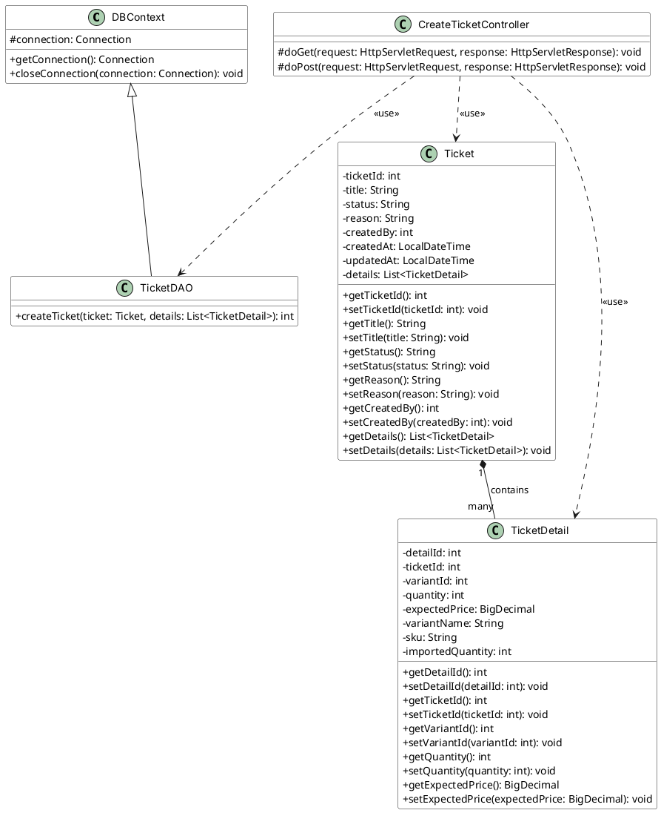

#### Sequence Diagram:
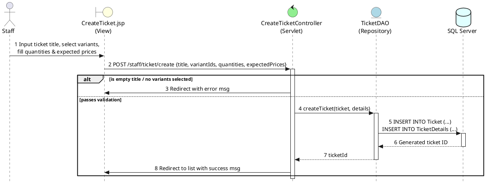

---

### 3.2.1.2.2: View Ticket List (Staff)

#### Class Diagram:
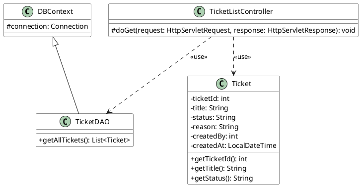

#### Sequence Diagram:
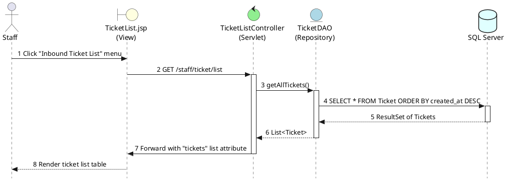

---

### 3.2.1.2.3: View Ticket List (Admin)

#### Class Diagram:
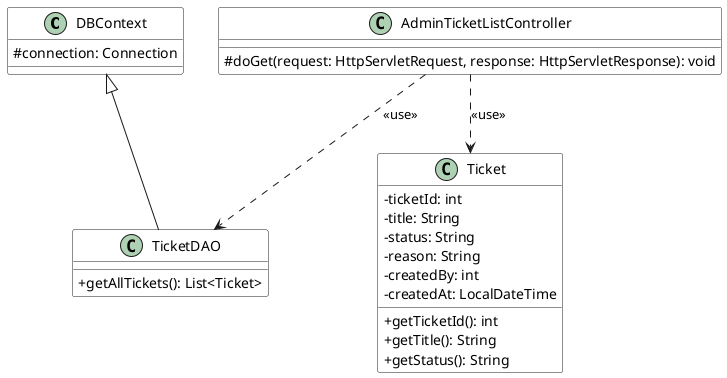

#### Sequence Diagram:
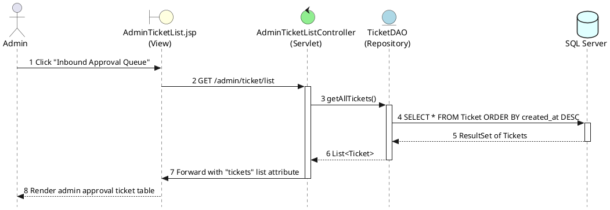

---

### 3.2.1.2.4: Review Ticket

#### Class Diagram:
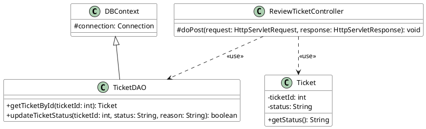

#### Sequence Diagram:
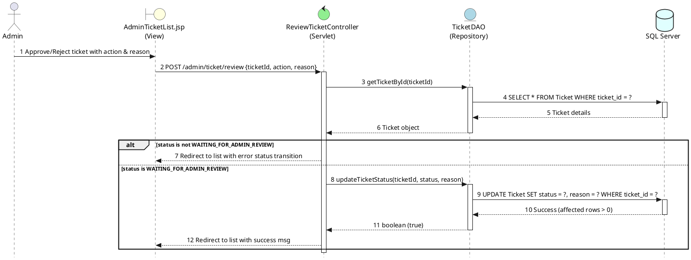

---

### 3.2.1.2.5: Cargo Workflow

#### Class Diagram:
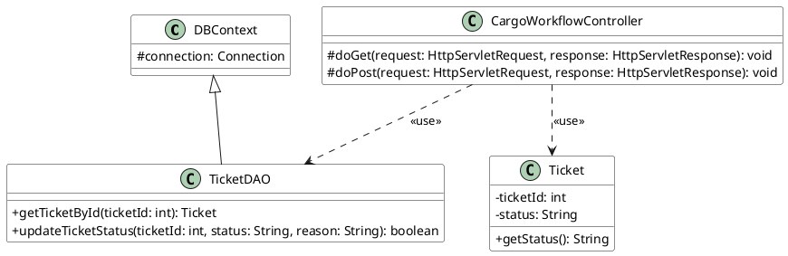

#### Sequence Diagram:
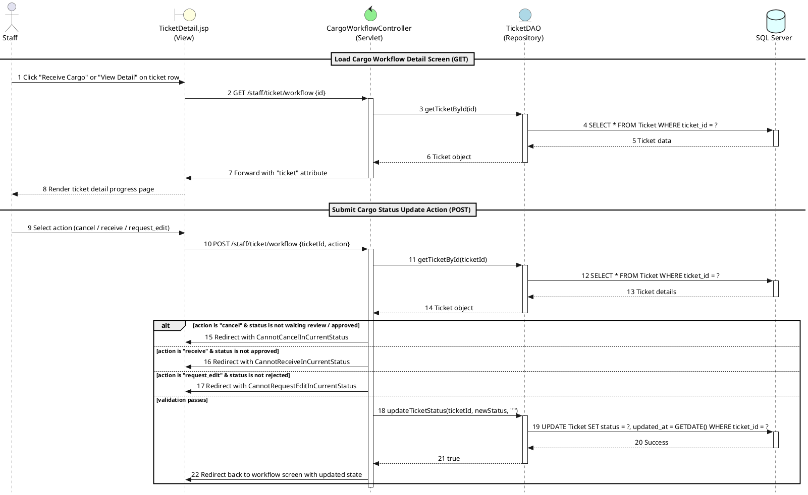

---

### 3.3: Manage Inventory and Register IMEI

#### Class Diagram:
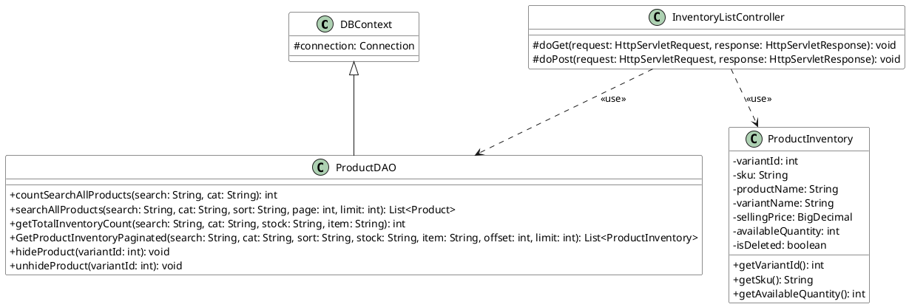

#### Sequence Diagram:
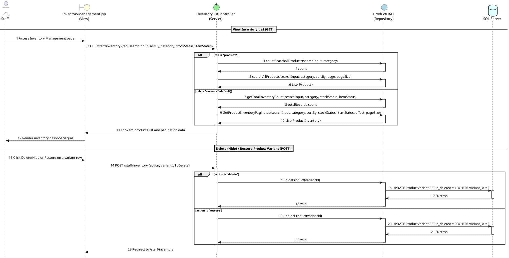

---

### 3.2.2: View Product List

#### Class Diagram:
```plantuml
@startuml
skinparam classAttributeIconSize 0
skinparam ClassBackgroundColor #ffffff
skinparam ClassBorderColor #1a1a1a

class DBContext {
    # connection: Connection
}

class ProductDAO {
    + countSearchAllProducts(search: String): int
    + searchAllProducts(search: String, page: int, limit: int): List<Product>
    + getCategoryIdByProductSearch(search: String): Integer
}

class ProductListFilterDAO {
    + filterLaptop(brandId: Integer, seriesId: Integer, purpose: String, cpu: String, ram: String, ssd: String, gpu: String, screen: String, price: String, sort: String, page: int, limit: int, search: String): List<Product>
    + filterKeyboard(brandId: Integer, purpose: String, connectivity: String, switchType: String, price: String, sort: String, page: int, limit: int, search: String): List<Product>
    + filterMouse(brandId: Integer, purpose: String, connectivity: String, dpi: String, price: String, sort: String, page: int, limit: int, search: String): List<Product>
    + filterGeneral(catId: int, brandId: Integer, price: String, sort: String, page: int, limit: int, search: String): List<Product>
    + countFilteredLaptop(...): int
    + countFilteredKeyboard(...): int
    + countFilteredMouse(...): int
    + countFilteredGeneral(...): int
}

class CategoryDAO {
    + getCategoryIdByName(name: String): Integer
    + getAllCategories(): List<Category>
}

class BrandDao {
    + getBrandsByCategory(catId: int): List<Brand>
}

class ProductListServlet {
    # doGet(request: HttpServletRequest, response: HttpServletResponse): void
}

DBContext <|-- ProductDAO
DBContext <|-- ProductListFilterDAO
DBContext <|-- CategoryDAO
DBContext <|-- BrandDao
ProductListServlet ..> ProductDAO : <<use>>
ProductListServlet ..> ProductListFilterDAO : <<use>>
ProductListServlet ..> CategoryDAO : <<use>>
ProductListServlet ..> BrandDao : <<use>>
@enduml
```

#### Sequence Diagram:
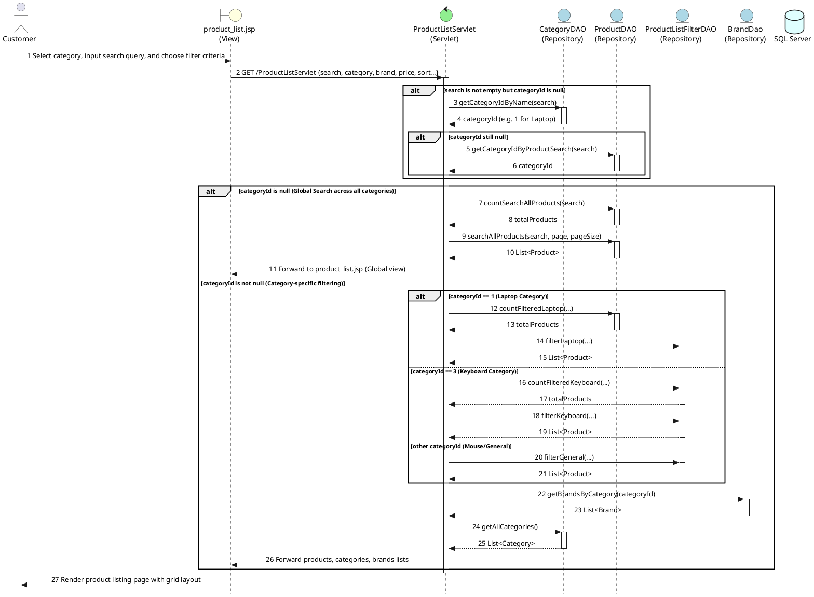

---

### 3.2.3: Add Product

#### Class Diagram:
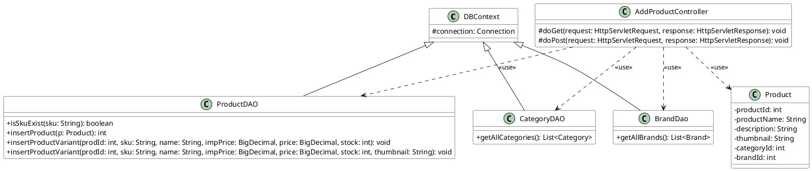

#### Sequence Diagram:
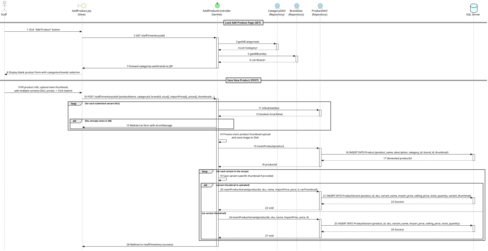

---

### 3.2.4: Edit Product

#### Class Diagram:
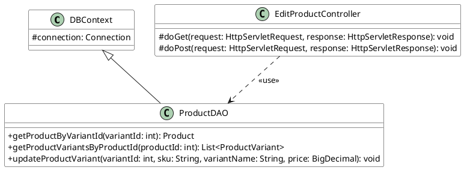

#### Sequence Diagram:
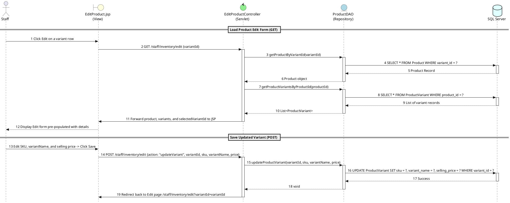

---

### 3.2.5: Manage Category

#### Class Diagram:
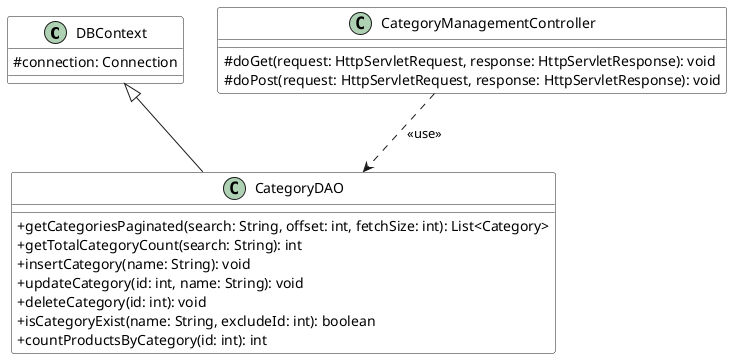

#### Sequence Diagram:
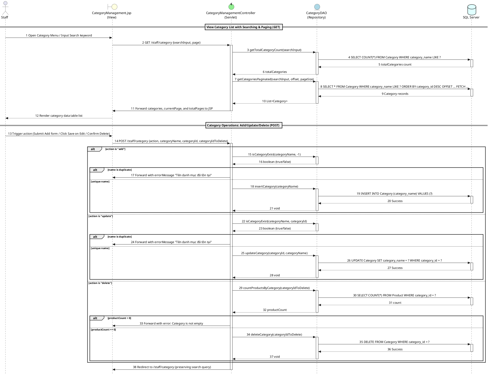

---

### 3.2.6: View IMEI Product List

#### Class Diagram:
```plantuml
@startuml
skinparam classAttributeIconSize 0
skinparam ClassBackgroundColor #ffffff
skinparam ClassBorderColor #1a1a1a

class DBContext {
    # connection: Connection
}

class ImeiDAO {
    + getInventoryItems(search: String, statusFilter: String, offset: int, fetchSize: int): List<InventoryItem>
    + getTotalInventoryItemsCount(search: String, statusFilter: String): int
    + getCountByStatus(status: String): int
}

class InventoryItem {
    - itemId: int
    - serialNumber: String
    - status: String
    - importDate: String
    - soldDate: LocalDate
    - warrantyExpiredDate: LocalDate
    - sku: String
    - variantName: String
    - productName: String
}

class ImeiManagement {
    # doGet(request: HttpServletRequest, response: HttpServletResponse): void
}

DBContext <|-- ImeiDAO
ImeiManagement ..> ImeiDAO : <<use>>
ImeiManagement ..> InventoryItem : <<use>>
@uml
@enduml
```

#### Sequence Diagram:
```plantuml
@startuml
skinparam Style strictuml
skinparam SequenceMessageAlign center

actor Staff

boundary "ImeiManagement.jsp\n(View)" as View #lightyellow
control "ImeiManagement\n(Servlet)" as Controller #lightgreen
entity "ImeiDAO\n(Repository)" as DAO #lightblue
database "SQL Server" as DB #lightcyan

Staff -> View : 1 Click "IMEI Management" / Filter status or search Serial
View -> Controller : 2 GET /staff/imei {searchInput, status, page}
activate Controller

Controller -> DAO : 3 getInventoryItems(searchInput, status, offset, pageSize)
activate DAO
DAO -> DB : 4 SELECT * FROM InventoryItem joined with Variant & Product details
activate DB
DB --> DAO : 5 ResultSet rows
deactivate DB
DAO --> Controller : 6 List<InventoryItem>
deactivate DAO

Controller -> DAO : 7 getTotalInventoryItemsCount(searchInput, status)
activate DAO
DAO --> Controller : 8 totalCount
deactivate DAO

Controller -> DAO : 9 getCountByStatus(null)
activate DAO
DAO --> Controller : 10 totalUnits count
deactivate DAO

Controller -> DAO : 11 getCountByStatus("in_stock")
activate DAO
DAO --> Controller : 12 inStockUnits count
deactivate DAO

Controller -> DAO : 13 getCountByStatus("sold")
activate DAO
DAO --> Controller : 14 soldUnits count
deactivate DAO

Controller -> View : 15 Forward items list, stats summary and search parameters
deactivate Controller
View --> Staff : 16 Render Serial/IMEI tables with status badges & stats counters
@endl
@enduml
```

---

### 3.2.7: Add Product IMEI

#### Class Diagram:
```plantuml
@startuml
skinparam classAttributeIconSize 0
skinparam ClassBackgroundColor #ffffff
skinparam ClassBorderColor #1a1a1a

class DBContext {
    # connection: Connection
}

class ImeiDAO {
    + insertInventoryItems(items: List<InventoryItem>): void
}

class TicketDAO {
    + getTicketDetails(ticketId: int): List<TicketDetail>
    + isTicketFullyImported(ticketId: int): boolean
    + updateTicketStatus(ticketId: int, status: String, reason: String): boolean
}

class ProductDAO {
    + getVariantById(id: int): ProductVariant
    + getProductByVariantId(id: int): Product
}

class AddProductImeiController {
    # doGet(request: HttpServletRequest, response: HttpServletResponse): void
    # doPost(request: HttpServletRequest, response: HttpServletResponse): void
}

DBContext <|-- ImeiDAO
DBContext <|-- TicketDAO
DBContext <|-- ProductDAO
AddProductImeiController ..> ImeiDAO : <<use>>
AddProductImeiController ..> TicketDAO : <<use>>
AddProductImeiController ..> ProductDAO : <<use>>
@enduml
```

#### Sequence Diagram:
```plantuml
@startuml
skinparam Style strictuml
skinparam SequenceMessageAlign center

actor Staff

boundary "AddProductImei.jsp\n(View)" as View #lightyellow
control "AddProductImeiController\n(Servlet)" as Controller #lightgreen
entity "TicketDAO\n(Repository)" as TDAO #lightblue
entity "ProductDAO\n(Repository)" as PDAO #lightblue
entity "ImeiDAO\n(Repository)" as IDAO #lightblue
database "SQL Server" as DB #lightcyan

== Load Serial Registration Form (GET) ==
Staff -> View : 1 Click "Register Serial/IMEI" on variant import row
View -> Controller : 2 GET /staff/imei/add {ticketId, variantId}
activate Controller

Controller -> TDAO : 3 getTicketDetails(ticketId)
activate TDAO
TDAO --> Controller : 4 List<TicketDetail> (identify expected quantity)
deactivate TDAO

Controller -> PDAO : 5 getVariantById(variantId)
activate PDAO
PDAO --> Controller : 6 ProductVariant details
deactivate PDAO

Controller -> PDAO : 7 getProductByVariantId(variantId)
activate PDAO
PDAO --> Controller : 8 Product details
deactivate PDAO

Controller -> View : 9 Forward ticketId, expectedQuantity, Product and Variant
deactivate Controller
View --> Staff : 10 Display dynamic text fields based on expected quantity

== Register Scanned Serials (POST) ==
Staff -> View : 11 Type/Scan serial numbers and receivedDate -> Click Submit
View -> Controller : 12 POST /staff/imei/add {variantId, ticketId, serialNumbers[], receivedDate}
activate Controller

alt serialNumbers quantity does not match expected quantity
    Controller -> View : 13 Redirect to page with error MismatchImeisQuantity
end

Controller -> IDAO : 14 insertInventoryItems(itemsList)
activate IDAO
IDAO -> DB : 15 Check if any serial number is duplicate in DB
activate DB
DB --> IDAO : 16 Count (0)
deactivate DB

IDAO -> DB : 17 START TRANSACTION\nINSERT INTO InventoryItem (variant_id, serial_number, status, import_date, warranty_expired_date, ticket_id) VALUES (?, ?, ?, ?, ?, ?)\nUPDATE [Inventory] SET available_quantity = available_quantity + ? WHERE variant_id = ?\nCOMMIT
activate DB
DB --> IDAO : 18 Transaction success
deactivate DB
IDAO --> Controller : 19 void
deactivate IDAO

alt ticketId is provided (part of Ticket Inbound cargo receipt)
    Controller -> TDAO : 20 isTicketFullyImported(ticketId)
    activate TDAO
    TDAO -> DB : 21 SELECT count of variants not fully imported in this ticket
    activate DB
    DB --> TDAO : 22 Count (0 if fully imported)
    deactivate DB
    TDAO --> Controller : 23 true / false
    deactivate TDAO
    
    alt ticket is fully imported
        Controller -> TDAO : 24 updateTicketStatus(ticketId, "COMPLETED", reason)
        activate TDAO
        TDAO -> DB : 25 UPDATE Ticket SET status = 'COMPLETED' WHERE ticket_id = ?
        activate DB
        DB --> TDAO : 26 Success
        deactivate DB
        TDAO --> Controller : 27 true
        deactivate TDAO
        Controller -> View : 28 Redirect to workflow page with success message: InboundCompleted
    else ticket is partially imported (other variants waiting)
        Controller -> View : 29 Redirect to workflow page with success message: VariantImported
    end
else ticketId is null (stand-alone IMEI addition)
    Controller -> View : 30 Redirect to /staff/imei with success message: Added
end

deactivate Controller
@enduml
```

---

## 2. Section 3.7 & 3.8: Outbound Management

### 3.7.1: View Pending Orders

#### Class Diagram:
```plantuml
@startuml
skinparam classAttributeIconSize 0
skinparam ClassBackgroundColor #ffffff
skinparam ClassBorderColor #1a1a1a

class DBContext {
    # connection: Connection
}

class OutboundDAO {
    + getPendingOrders(offset: int, limit: int): List<Order>
    + getTotalPendingOrders(): int
    + getOrderById(orderId: int): Order
    + getOrderDetails(orderId: int): List<OrderDetail>
}

class Order {
    - orderId: int
    - totalAmount: BigDecimal
    - shippingFee: BigDecimal
    - orderStatus: String
    - shippingReceiver: String
    - shippingPhone: String
    - shippingAddress: String
    - orderCode: String
    - userId: Integer
    - trackingNumber: String
    - shippingPartner: String
    + getOrderId(): int
    + getOrderStatus(): String
    + getOrderCode(): String
}

class OutboundListController {
    # doGet(request: HttpServletRequest, response: HttpServletResponse): void
}

DBContext <|-- OutboundDAO
OutboundListController ..> OutboundDAO : <<use>>
OutboundListController ..> Order : <<use>>
@enduml
```

#### Sequence Diagram:
```plantuml
@startuml
skinparam Style strictuml
skinparam SequenceMessageAlign center

actor Staff

boundary "OrderList.jsp\n(View)" as View #lightyellow
control "OutboundListController\n(Servlet)" as Controller #lightgreen
entity "OutboundDAO\n(Repository)" as DAO #lightblue
database "SQL Server" as DB #lightcyan

Staff -> View : 1 Access Outbound list
View -> Controller : 2 GET /staff/outbound/list {page}
activate Controller

Controller -> DAO : 3 getTotalPendingOrders()
activate DAO
DAO -> DB : 4 SELECT COUNT(*) FROM [Order] WHERE order_status IN ('pending', 'processing')
activate DB
DB --> DAO : 5 count
deactivate DB
DAO --> Controller : 6 totalRecords (e.g., 25)
deactivate DAO

Controller -> DAO : 7 getPendingOrders(offset, pageSize)
activate DAO
DAO -> DB : 8 SELECT * FROM [Order] WHERE order_status IN ('pending', 'processing')\nORDER BY completed_at OFFSET ... FETCH ...
activate DB
DB --> DAO : 9 Order records
deactivate DB
DAO --> Controller : 10 List<Order>
deactivate DAO

Controller -> View : 11 Forward with list of orders, page, totalPages
deactivate Controller
View --> Staff : 12 Render pending order queue table view
@enduml
```

---

### 3.7.2: Assign Serial/IMEI & Fulfill Order

#### Class Diagram:
```plantuml
@startuml
skinparam classAttributeIconSize 0
skinparam ClassBackgroundColor #ffffff
skinparam ClassBorderColor #1a1a1a

class DBContext {
    # connection: Connection
}

class OutboundDAO {
    + getOrderById(orderId: int): Order
    + getOrderDetails(orderId: int): List<OrderDetail>
    + getAvailableImeisForVariant(variantId: int): List<InventoryItem>
    + executeOutboundTransaction(orderId: int, orderDetailToItemIds: Map<Integer, List<Integer>>): boolean
}

class OutboundFulfillController {
    # doGet(request: HttpServletRequest, response: HttpServletResponse): void
    # doPost(request: HttpServletRequest, response: HttpServletResponse): void
}

class OrderDetail {
    - orderDetailId: int
    - quantity: int
    - unitPrice: BigDecimal
    - orderId: int
    - variantId: int
    - variantName: String
    - sku: String
}

DBContext <|-- OutboundDAO
OutboundFulfillController ..> OutboundDAO : <<use>>
OutboundFulfillController ..> OrderDetail : <<use>>
@enduml
```

#### Sequence Diagram:
```plantuml
@startuml
skinparam Style strictuml
skinparam SequenceMessageAlign center

actor Staff

boundary "OrderFulfillment.jsp\n(View)" as View #lightyellow
control "OutboundFulfillController\n(Servlet)" as Controller #lightgreen
entity "OutboundDAO\n(Repository)" as DAO #lightblue
database "SQL Server" as DB #lightcyan

Staff -> View : 1 Click Fulfill on order row
View -> Controller : 2 GET /staff/outbound/fulfill {orderId}
activate Controller

Controller -> DAO : 3 getOrderById(orderId)
activate DAO
DAO -> DB : 4 SELECT * FROM [Order] WHERE order_id = ?
activate DB
DB --> DAO : 5 Order Record
deactivate DB
DAO --> Controller : 6 Order object
deactivate DAO

Controller -> DAO : 7 getOrderDetails(orderId)
activate DAO
DAO -> DB : 8 SELECT * FROM [OrderDetail] WHERE order_id = ?
activate DB
DB --> DAO : 9 OrderDetail records
deactivate DB
DAO --> Controller : 10 List<OrderDetail>
deactivate DAO

loop for each OrderDetail
    Controller -> DAO : 11 getAvailableImeisForVariant(variantId)
    activate DAO
    DAO -> DB : 12 SELECT item_id, serial_number FROM [InventoryItem] WHERE variant_id = ? AND status = 'in_stock'
    activate DB
    DB --> DAO : 13 List of available Serial items
    deactivate DB
    DAO --> Controller : 14 List<InventoryItem>
    deactivate DAO
end

Controller -> View : 15 Forward to OrderFulfillment.jsp with order details & available Serials
deactivate Controller

Staff -> View : 16 Select matching Serials for each product and submit
View -> Controller : 17 POST /staff/outbound/fulfill {orderId, detail_xxxx[]}
activate Controller

Controller -> DAO : 18 executeOutboundTransaction(orderId, orderDetailToItemIds)
activate DAO
DAO -> DB : 19 START TRANSACTION
activate DB

loop for each selected serial item ID
    DAO -> DB : 20 UPDATE InventoryItem SET status = 'sold', sold_date = GETDATE() WHERE item_id = ? AND status = 'in_stock'
    DB --> DAO : 21 Success (affected row > 0)
    
    DAO -> DB : 22 INSERT INTO OrderItemSerial (order_detail_id, item_id, assigned_at) VALUES (?, ?, GETDATE())
    DB --> DAO : 23 Success
end

DAO -> DB : 24 UPDATE [Order] SET order_status = 'shipped' WHERE order_id = ?
DB --> DAO : 25 Success

DAO -> DB : 26 COMMIT TRANSACTION
DB --> DAO : 27 Transaction Committed
deactivate DB
DAO --> Controller : 28 boolean (true)
deactivate DAO

Controller -> View : 29 Redirect to Print controller (/staff/outbound/print?orderId=...)
deactivate Controller
@enduml
```

---

### 3.7.3: Print Invoice Slip

#### Class Diagram:
```plantuml
@startuml
skinparam classAttributeIconSize 0
skinparam ClassBackgroundColor #ffffff
skinparam ClassBorderColor #1a1a1a

class DBContext {
    # connection: Connection
}

class OutboundPrintController {
    # doGet(request: HttpServletRequest, response: HttpServletResponse): void
}

class OutboundDAO {
    + getOrderById(orderId: int): Order
    + getOrderDetails(orderId: int): List<OrderDetail>
    + getAssignedImeisForOrderDetail(orderDetailId: int): List<InventoryItem>
}

DBContext <|-- OutboundDAO
OutboundPrintController ..> OutboundDAO : <<use>>
@enduml
```

#### Sequence Diagram:
```plantuml
@startuml
skinparam Style strictuml
skinparam SequenceMessageAlign center

actor Staff

boundary "DeliverySlip.jsp\n(View)" as View #lightyellow
control "OutboundPrintController\n(Servlet)" as Controller #lightgreen
entity "OutboundDAO\n(Repository)" as DAO #lightblue
database "SQL Server" as DB #lightcyan

Staff -> View : 1 Select to print slip / Redirected from fulfillment
View -> Controller : 2 GET /staff/outbound/print {orderId}
activate Controller

Controller -> DAO : 3 getOrderById(orderId)
activate DAO
DAO -> DB : 4 SELECT * FROM [Order] WHERE order_id = ?
activate DB
DB --> DAO : 5 Order Record
deactivate DB
DAO --> Controller : 6 Order object
deactivate DAO

Controller -> DAO : 7 getOrderDetails(orderId)
activate DAO
DAO -> DB : 8 SELECT * FROM [OrderDetail] WHERE order_id = ?
activate DB
DB --> DAO : 9 OrderDetail records
deactivate DB
DAO --> Controller : 10 List<OrderDetail>
deactivate DAO

loop for each OrderDetail
    Controller -> DAO : 11 getAssignedImeisForOrderDetail(orderDetailId)
    activate DAO
    DAO -> DB : 12 SELECT ii.item_id, ii.serial_number FROM InventoryItem ii\nJOIN OrderItemSerial ois ON ii.item_id = ois.item_id\nWHERE ois.order_detail_id = ?
    activate DB
    DB --> DAO : 13 Assigned Serial items records
    deactivate DB
    DAO --> Controller : 14 List<InventoryItem>
    deactivate DAO
end

Controller -> View : 15 Forward to DeliverySlip.jsp (Renders invoice & serials for print)
deactivate Controller
@enduml
```

---

### 3.7.4: View Outbound History

#### Class Diagram:
```plantuml
@startuml
skinparam classAttributeIconSize 0
skinparam ClassBackgroundColor #ffffff
skinparam ClassBorderColor #1a1a1a

class DBContext {
    # connection: Connection
}

class OutboundHistoryController {
    # doGet(request: HttpServletRequest, response: HttpServletResponse): void
}

class OutboundDAO {
    + getOutboundHistory(offset: int, limit: int): List<Order>
    + getTotalOutboundHistory(): int
}

DBContext <|-- OutboundDAO
OutboundHistoryController ..> OutboundDAO : <<use>>
@enduml
```

#### Sequence Diagram:
```plantuml
@startuml
skinparam Style strictuml
skinparam SequenceMessageAlign center

actor Staff

boundary "OrderHistory.jsp\n(View)" as View #lightyellow
control "OutboundHistoryController\n(Servlet)" as Controller #lightgreen
entity "OutboundDAO\n(Repository)" as DAO #lightblue
database "SQL Server" as DB #lightcyan

Staff -> View : 1 Access Outbound History page
View -> Controller : 2 GET /staff/outbound/history {page}
activate Controller

Controller -> DAO : 3 getTotalOutboundHistory()
activate DAO
DAO -> DB : 4 SELECT COUNT(*) FROM [Order] WHERE order_status IN ('shipped', 'delivered', 'cancelled')
activate DB
DB --> DAO : 5 count
deactivate DB
DAO --> Controller : 6 totalRecords
deactivate DAO

Controller -> DAO : 7 getOutboundHistory(offset, pageSize)
activate DAO
DAO -> DB : 8 SELECT * FROM [Order] WHERE order_status IN ('shipped', 'delivered', 'cancelled')\nORDER BY completed_at DESC OFFSET ... FETCH ...
activate DB
DB --> DAO : 9 Order records
deactivate DB
DAO --> Controller : 10 List<Order>
deactivate DAO

Controller -> View : 11 Forward with list of orders, page, totalPages to OrderHistory.jsp
deactivate Controller
View --> Staff : 12 Render outbound history records table view
@enduml
```
